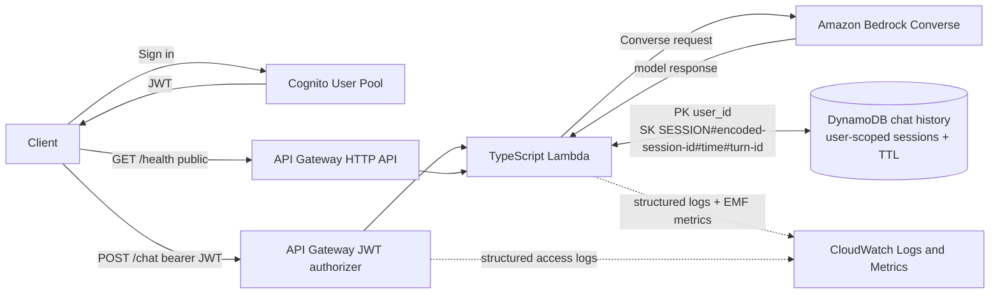

# AWS GenAI Starter

[](https://github.com/hongzz0618/aws-genai-starter/actions/workflows/ci.yml)

Authenticated serverless GenAI chat API reference on AWS.

The project demonstrates a compact backend path with Cognito authentication, API
Gateway JWT authorization, a TypeScript Lambda, Amazon Bedrock Converse,
user-scoped DynamoDB chat history, bounded context, retention, structured
telemetry, and Terraform validation.

It is a learning-oriented reference for backend and infrastructure design. It is
not intended to be deployed unchanged as a public service.

## Use Case

The API supports authenticated chat requests where each caller can maintain named
chat sessions. Session IDs are caller-local conversation identifiers, not global
authorization boundaries. A user can reuse `demo-session` without seeing another
user's history for the same session ID.

## Architecture



Runtime path for `POST /chat`:

1. API Gateway validates the Cognito JWT for `/chat`.
2. Lambda reads `requestContext.authorizer.jwt.claims.sub`.
3. Lambda rejects missing or malformed identity and ignores client-supplied user identity.
4. Request JSON is validated against bounded fields.
5. Recent history is queried only under the authenticated user key and requested session prefix.
6. History is trimmed to an approximate character budget before Bedrock is called.
7. Non-empty text response is required before the turn is saved.
8. The turn is written with a TTL epoch value and structured telemetry is emitted.

`GET /health` remains public.

## API

### `GET /health`

No authentication required.

```json
{
  "status": "ok",
  "service": "aws-genai-starter"
}
```

### `POST /chat`

Requires a Cognito JWT accepted by the API Gateway HTTP API JWT authorizer.

```bash
curl -X POST "<api-url>/chat" \
  -H "Authorization: Bearer <jwt>" \
  -H "Content-Type: application/json" \
  -d '{
    "session_id": "demo-session",
    "prompt": "Give a short greeting."
  }'
```

Accepted request fields:

- `prompt`: required string, 1 to 8000 trimmed characters
- `session_id`: optional string, up to 128 trimmed characters; generated when omitted or blank
- `system_prompt`: optional string, up to 4000 trimmed characters
- `history_turns`: optional integer from 0 to 20
- `max_tokens`: optional integer from 1 to 4096
- `temperature`: optional number from 0 to 1
- `top_p`: optional number from 0 to 1

`temperature` and `top_p` are mutually exclusive. Supply at most one.

Clients cannot set `model_id` or `user_id`.

Common responses:

- `200`: assistant response with usage metadata when Bedrock returns non-empty text and DynamoDB save succeeds
- `400`: invalid request body or unsupported client-controlled fields
- `401`: missing or malformed authenticated identity
- `500`: internal or persistence failure
- `502`: Bedrock validation failure or empty/non-text model response
- `503`: Bedrock throttling or temporary availability failure

OpenAPI documentation is in `openapi/openapi.yaml`.

## Live AWS Validation

The dev environment was deployed and validated in `eu-west-1`, then destroyed
after the validation window. Terraform managed 35 project resources; the final
reconciliation apply completed with `0 added, 0 changed, 0 destroyed`, which
confirmed deployed state alignment rather than first-time creation. The
validation covered the public health route, JWT-protected chat route,
Cognito-authorized Bedrock invocation, DynamoDB conversation restoration, TTL,
structured logs, EMF metrics, and teardown checks. Screenshots are sanitized and
do not expose account IDs, API URLs, Cognito IDs, JWTs, IAM ARNs, Marketplace
offer IDs, or agreement IDs.

| Area | Validation | Result |
| --- | --- | --- |
| Infrastructure | Terraform reconciliation | Passed |
| Authorization | Missing JWT rejected | Passed |
| Model invocation | Authenticated Bedrock response | Passed |
| Persistence | User/session history and TTL | Passed |
| Observability | Structured logs and EMF metrics | Passed |
| Teardown | 35 resources destroyed | Passed |

Deployment findings:

- Cost Anomaly Detection service monitors are account-level resources. The tested
  account already had a default service monitor, so the project made that monitor
  optional and keeps it disabled in `live/dev` while retaining budgets, alarms,
  and other cost visibility resources.
- Claude Haiku 4.5 rejected requests that included both `temperature` and
  `topP`. The API now treats `temperature` and `top_p` as mutually exclusive,
  returns HTTP 400 for conflicts before DynamoDB or Bedrock calls, and sends only
  one sampling field to Bedrock.

Detailed evidence and limitations are documented in [docs/deployment-validation.md](docs/deployment-validation.md).


Route-level authorization: `GET /health` is public and `POST /chat` uses a JWT authorizer.


Authenticated path through Cognito, API Gateway, Lambda, and Bedrock returned HTTP 200 using Claude Haiku 4.5.


A reused authenticated session restored prior history and answered the follow-up with the earlier subject.


CloudWatch received EMF metrics; the two failures shown came from controlled
validation before the sampling-parameter fix.


Teardown destroyed 35 Terraform-managed resources and left no managed resources in state.

## DynamoDB Design

The reference schema is intentionally user-scoped:

```text
PK user_id
SK SESSION#<base64url-session-id>#<epoch-ms-padded>#<turn-id>
```

Queries use:

```text
user_id = authenticated sub
begins_with(sk, "SESSION#<base64url-session-id>#")
ConsistentRead = true
ScanIndexForward = false
Limit = history_turns
```

The Lambda reverses selected items back to chronological order before Bedrock
receives them. Invalid stored records are skipped without unbounded backfill.

Strongly consistent reads favor immediate follow-up context correctness after a
successful write, at the cost of higher read-capacity consumption than
eventually consistent reads.

The caller-facing `session_id` is deterministically base64url-encoded before it
is used in the sort key. This prevents delimiter and prefix-boundary confusion
for values containing characters such as `#`, `/`, spaces, or Unicode.

The sort key also includes a generated turn ID so same-millisecond writes do not overwrite each other.

This is a new reference schema; the repository does not include production data migration logic.

## Retention

Chat turns are written with:

```text
expires_at = current epoch seconds + CHAT_RETENTION_DAYS
```

Terraform enables DynamoDB TTL on `expires_at`. The default retention in `live/dev` is 7 days.

DynamoDB TTL deletion is asynchronous. Expired items can remain visible for some
time and should not be treated as a strict real-time deletion mechanism.

## Bounded Context

The Lambda keeps existing prompt and system prompt size limits and adds
`MAX_CONTEXT_CHARS` for stored history sent to Bedrock.

The budget is an approximate application-level character guardrail, not a
tokenizer-accurate token counter. The current prompt is always preserved. Stored
history is included as complete user/assistant turns, keeping the newest
contiguous suffix that fits the budget and dropping older turns first. If the
newest stored turn itself does not fit, history is omitted rather than keeping
older context out of order.

`system_prompt` is handled separately through the Bedrock Converse `system` field.

## Observability

The Lambda emits structured JSON logs and CloudWatch EMF metrics.

Logged metadata includes service name, event name, request ID, hashed
user/session identifiers, model ID, failure category, latency, history turn
count, and context truncation status.

The Lambda does not log prompts, system prompts, full request bodies, JWTs,
Authorization headers, full history, or raw sensitive Bedrock response payloads.

Metrics include:

- `ChatRequestCount`
- `ChatSuccessCount`
- `ChatFailureCount`
- `BedrockThrottleCount`
- `BedrockLatency`
- `InputTokens`
- `OutputTokens`
- `TotalTokens`
- `ContextTruncatedCount`

Metric dimensions avoid high-cardinality user IDs, session IDs, and request IDs.

API Gateway `$default` stage access logs include request ID, route key, status,
latency, integration latency, error summary, and source IP. Authorization
headers are not logged.

Terraform also defines selected alarms for Lambda errors, Lambda throttles, API
5XX, latency, DynamoDB throttles, and Bedrock throttle custom metrics.

## Terraform

Terraform `>= 1.7.0` is required for the native plan tests.

The `live/dev` root defines:

- Cognito User Pool and app client without a client secret
- API Gateway HTTP API with route-level JWT authorization
- Public `GET /health`
- Protected `POST /chat`
- TypeScript Lambda environment configuration
- DynamoDB table with `user_id` and `sk` keys plus TTL
- Scoped Lambda IAM for DynamoDB `PutItem` and `Query`
- Exact Bedrock IAM resource examples without wildcard Bedrock resources
- CloudWatch logs, metrics, selected alarms, dashboard, and cost alert examples
- Native Terraform plan tests for Cognito, API Gateway, DynamoDB, IAM, log retention, and observability contracts

The configuration validates and tests locally without deploying resources. Do not
run `terraform apply` unless you intentionally want to create AWS resources.

## Local Validation

```bash
npm ci
npm audit --omit=dev
npm run typecheck
npm test
npm run build
bash scripts/package_lambda.sh
npm run contract:validate
npm run test:contract
npm run artifacts:verify

terraform fmt -check -recursive
cd live/dev
terraform init -backend=false -input=false
terraform validate -no-color
terraform test -no-color
```

CI runs these checks without AWS credentials or deployment.

## Project Structure

- `src-ts/`: Lambda TypeScript source
- `tests/`: unit, infrastructure static, and API contract tests
- `openapi/openapi.yaml`: documented API contract
- `docs/deployment-validation.md`: sanitized live AWS validation evidence and findings
- `docs/evidence/`: sanitized validation screenshots
- `docs/adr/`: architecture decision records
- `modules/`: reusable Terraform modules
- `live/dev/`: local-validating dev Terraform root
- `live/dev/tests/plan_contracts.tftest.hcl`: native Terraform plan contract tests
- `scripts/package_lambda.sh`: Lambda artifact packaging
- `scripts/verify_lambda_artifact.sh`: Lambda artifact sanity checks
- `.github/workflows/ci.yml`: application, artifact, contract, and Terraform checks

## Boundaries and Limitations

- The live AWS evidence is a time-bounded dev environment validation, not proof of a continuously running environment.
- The validated resources were destroyed after testing.
- The Cognito app client keeps SRP enabled; `ALLOW_ADMIN_USER_PASSWORD_AUTH` is
  only for IAM-authenticated CLI deployment validation and does not mean public
  clients should use administrator authentication APIs.
- AWS Marketplace and Anthropic model access are account-level external
  prerequisites and are not Terraform-managed project resources.
- Cost controls are alerts and bounded request inputs, not hard spend enforcement.
- DynamoDB TTL is asynchronous.
- The API does not include RAG, vector storage, streaming, frontend UI, file
  uploads, tool calling, per-user quota enforcement, WAF, custom domains,
  multi-region deployment, or automatic deployment.
