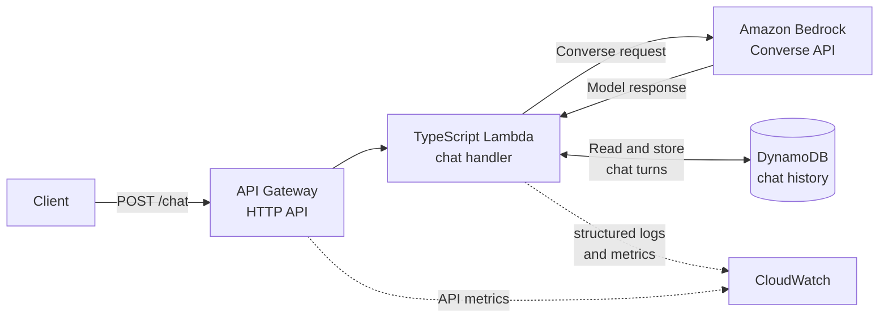

# AWS GenAI Starter

A compact reference project for adding managed model capabilities to a serverless backend on AWS.

The active request path is API Gateway HTTP API -> TypeScript Lambda -> Amazon Bedrock Converse -> DynamoDB chat history. Terraform defines the AWS resources, while GitHub Actions validates the application, Lambda package, and infrastructure configuration without deploying them.

## Use case

The project demonstrates a small backend pattern for applications that need model-assisted responses while still handling normal backend responsibilities: request validation, permissions, persistence, observability, and cost monitoring.

## Architecture overview



Runtime flow for `POST /chat`:

1. Validate and parse the JSON request body.
2. Load the most recent valid chat turns for the supplied session.
3. Call the Bedrock Converse API with the prompt and available history.
4. Store the new prompt and model response in DynamoDB.
5. Return the assistant response, usage metadata, stop reason, session ID, and timestamp.

## What's included

- Serverless HTTP API with API Gateway v2 and Lambda
- Active Lambda source in TypeScript under `src-ts/`
- DynamoDB chat history storage
- Amazon Bedrock Converse API invocation
- Input validation and generic public error responses
- Scoped DynamoDB and Bedrock IAM examples
- GitHub Actions checks with an OIDC trust example for future deployment workflows
- CloudWatch logs, metrics, alarms, and dashboard examples
- Optional SNS alerting, AWS Budgets, and Cost Anomaly Detection examples

## Project structure

- `live/dev/`: Terraform root module for the dev environment
- `modules/`: reusable Terraform modules
- `src-ts/`: active Lambda TypeScript source
- `tests/`: application and repository unit tests
- `dist/`: TypeScript build output generated by `npm run build`
- `build/lambda.zip`: Lambda deployment package generated by `scripts/package_lambda.sh`
- `scripts/`: packaging scripts
- `.github/workflows/`: GitHub Actions workflow definitions
- `backend.hcl.example`: placeholder-only example for optional remote Terraform state

Terraform deploys the Node.js Lambda with `handler = "handler.handler"` and packages the compiled `dist/` files with production dependencies.

The active Lambda returns generic public error responses for chat failures and logs only safe internal error metadata.

## API examples

Replace `<api-url>` with the `api_url` Terraform output from a deployed environment.

### `GET /health`

```bash
curl "<api-url>/health"
```

Example response:

```json
{
  "status": "ok",
  "service": "aws-genai-starter"
}
```

### `POST /chat`

```bash
curl -X POST "<api-url>/chat" \
  -H "Content-Type: application/json" \
  -d '{
    "session_id": "demo-session",
    "prompt": "Give a short greeting for a demo user."
  }'
```

Example request body:

```json
{
  "session_id": "demo-session",
  "prompt": "Give a short greeting for a demo user."
}
```

Accepted request fields:

- `prompt`: required string, 1 to 8000 trimmed characters
- `session_id`: optional string, up to 128 trimmed characters; if omitted or blank, the Lambda generates one
- `system_prompt`: optional string, up to 4000 trimmed characters
- `history_turns`: optional integer from 0 to 20; defaults to the Lambda configuration
- `max_tokens`: optional integer from 1 to 4096; defaults to the Lambda configuration
- `temperature`: optional number from 0 to 1; defaults to the Lambda configuration
- `top_p`: optional number from 0 to 1; defaults to the Lambda configuration

Clients cannot select the Bedrock model in the request body. The Lambda uses the configured `MODEL_ID`, which should match the Bedrock IAM resource ARNs configured in Terraform.

Example successful response shape:

```json
{
  "session_id": "demo-session",
  "timestamp": 1710000000000,
  "response": "Example assistant response.",
  "usage": {
    "inputTokens": 12,
    "outputTokens": 4,
    "totalTokens": 16
  },
  "stopReason": "end_turn"
}
```

Example generic processing error:

```json
{
  "error": "Chat request failed"
}
```

Malformed JSON, non-object request bodies, blank or oversized prompts, oversized session IDs or system prompts, invalid field types, invalid numeric ranges, and request-level `model_id` values return HTTP `400`:

```json
{
  "error": "Invalid chat request"
}
```

Bedrock throttling and temporary availability failures return HTTP `503` with a generic body. Bedrock validation failures return HTTP `502`. Bedrock access failures, persistence failures, and unexpected internal failures return a generic HTTP `500` response.

AWS request IDs, raw SDK messages, table names, stack traces, prompts, system prompts, and complete request bodies are not returned to clients. Logs use the stable `chat_request_failed` event with safe metadata such as failure category, error name, and SDK HTTP status when available.

A successful `POST /chat` response is returned only after the prompt and model response have been stored in DynamoDB.

## Terraform state

The committed `live/dev` configuration defaults to local Terraform state so the project can be initialized safely on a new machine.

For S3 remote state, use the placeholder-only values in `backend.hcl.example` and replace them with resources from your own AWS account. The repository does not include live-looking bucket, key, Region, or lock-table values.

## IAM notes

The GitHub OIDC module defines only the trust relationship. It does not attach broad AWS managed deployment permissions by default. A real deployment workflow still requires a project- and account-scoped policy.

The Lambda Bedrock policy grants only `bedrock:InvokeModel`, which is required by the current non-streaming Converse path. It does not grant `bedrock:InvokeModelWithResponseStream`.

The dev root sets `MODEL_ID` from `bedrock_model_id` and passes exact Bedrock resource ARNs to the IAM module. The committed example uses a system-defined inference profile ID, an account-scoped inference-profile ARN, and exact destination foundation-model ARNs.

The foundation-model statement is conditioned with `bedrock:InferenceProfileArn`, so those model ARNs can be invoked only through the configured inference profile.

Foundation models, system-defined inference profiles, and application inference profiles use different ARN formats. When changing models, update `bedrock_model_id`, `bedrock_foundation_model_id`, and `bedrock_inference_profile_destination_regions` together. Confirm destination model ARNs with the Bedrock model details or `GetInferenceProfile`.

The Terraform module rejects empty Bedrock resource lists, wildcard values, broad wildcard ARNs, and non-Bedrock ARNs during validation or planning. Static validation proves configuration syntax and wiring; a deployed Bedrock call is still required to prove account access, Region support, and model entitlement.

## CI and observability notes

GitHub Actions runs:

- dependency installation with `npm ci`
- TypeScript type checking
- unit tests
- TypeScript build
- Lambda packaging
- Terraform formatting
- Terraform initialization without a backend
- Terraform validation

The workflow validates the repository but does not deploy AWS resources.

The `live/dev` root passes actual API, Lambda, log-group, and DynamoDB identifiers into the observability module instead of duplicating names.

The Lambda custom error metric filter matches the stable `chat_request_failed` application event and intentionally excludes invalid request validation failures. Unit tests prove the structured application event, while actual CloudWatch filter matching still requires a deployed Lambda log event.

CloudWatch alarms, AWS Budgets, and Cost Anomaly Detection can publish notifications to the observability SNS topic. These services provide monitoring and alerts; they do not automatically prevent Bedrock usage or stop requests. Email subscriptions are optional and require confirmation after deployment.

## Maturity note

This is a learning-oriented reference project for understanding API Gateway, Lambda, Bedrock, DynamoDB, IAM, observability, and operational boundaries.

It is not intended to be deployed unchanged as a production system.

## Architecture trade-offs

- Managed Bedrock integration avoids custom model hosting, while model selection, access, and cost exposure remain explicit configuration concerns.
- The compact serverless path is easier to inspect than a larger AI platform, but it omits several controls expected in a public production service.
- DynamoDB fits session-based chat-history lookup with a small schema and predictable access pattern.
- Recent history is queried in descending sort-key order and restored to chronological order before being sent to Bedrock.
- Bounded history queries keep latency and reads predictable, but invalid records among the latest items are skipped rather than backfilled through unbounded pagination.
- OIDC trust avoids static GitHub credentials, but deployment permissions still need to be scoped for a specific account and workflow.
- The observability examples provide useful logs, metrics, alarms, and cost signals, not a complete operations model.

## Demo limitations

- The reference `POST /chat` route is unauthenticated.
- Caller-provided `session_id` values are conversation identifiers, not authorization or tenant-isolation boundaries.
- API Gateway HTTP API native CORS allows origin `*` in the reference environment. Restrict origins before exposing a deployed endpoint to browser clients.
- DynamoDB TTL is supported by the module but is not enabled in `live/dev`; stored chat history does not expire automatically.
- The API does not include per-user quotas, abuse controls, prompt-safety filtering, or request-level cost enforcement.
- AWS Budgets and Cost Anomaly Detection provide alerts rather than real-time request blocking.
- The active Lambda returns generic public errors; detailed failure metadata is intended for logs.
- The observability configuration includes account-level examples. Review budget, anomaly-detection, alarm, and SNS settings before applying them in an AWS account.
- Local and CI validation do not prove deployed Bedrock access, model entitlement, CloudWatch filter matching, notification delivery, or browser preflight behavior.

## Local validation

```bash
npm ci
npm run typecheck
npm test
npm run build
bash scripts/package_lambda.sh

terraform fmt -check -recursive
cd live/dev
terraform init -backend=false -input=false
terraform validate -no-color
```
