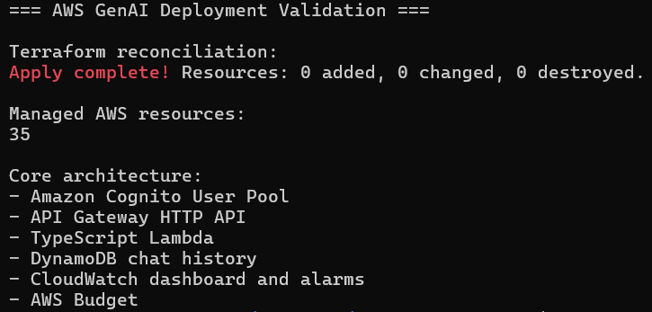
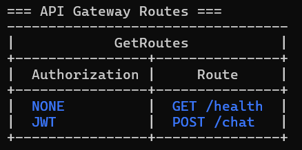
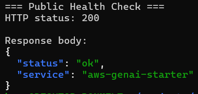
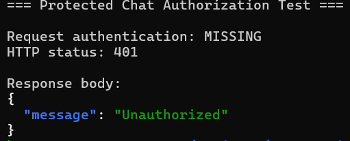
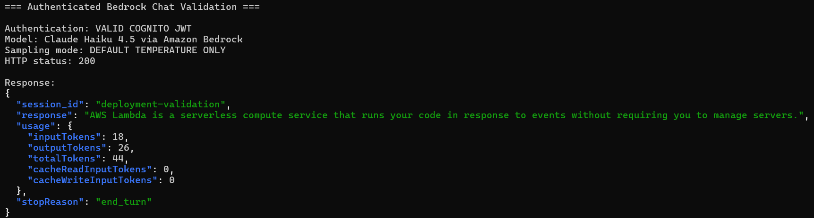
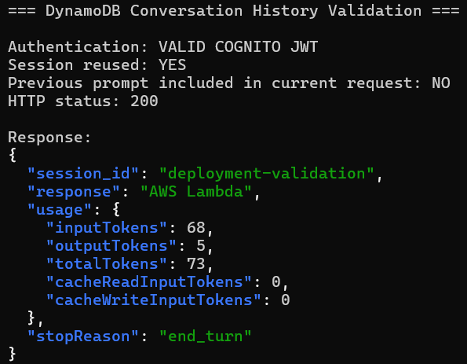
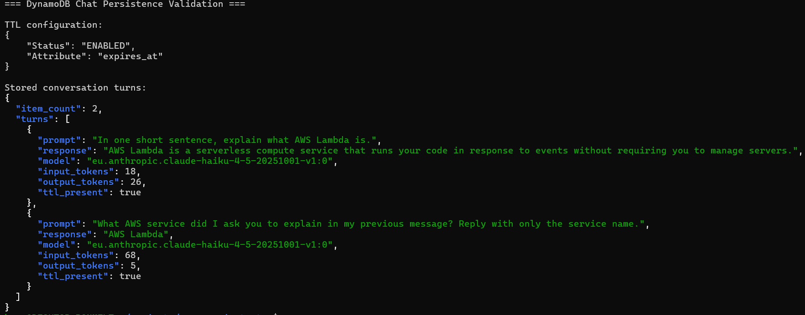
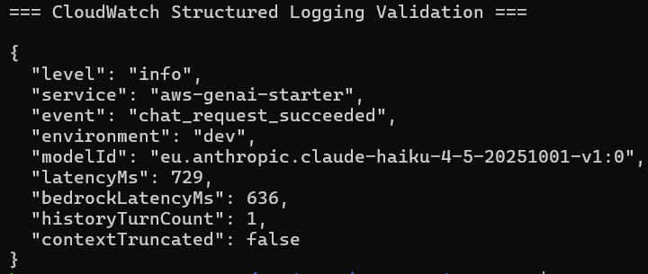
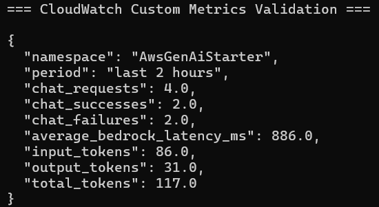
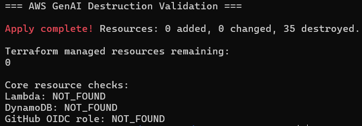

# AWS Deployment Validation

## Scope

This document records a sanitized live validation of the dev environment for the authenticated serverless chat path. It covers Terraform reconciliation, route authorization, health and chat behavior, Bedrock invocation, DynamoDB history persistence, CloudWatch logs and metrics, deployment findings, and teardown.

The screenshots in `docs/evidence/` are redacted. They do not disclose AWS account IDs, API URLs, Cognito IDs, JWTs, IAM ARNs, Marketplace offer IDs, or agreement IDs.

## Environment

- AWS Region: `eu-west-1`
- Terraform root: `live/dev`
- Bedrock inference profile: `eu.anthropic.claude-haiku-4-5-20251001-v1:0`
- Lambda runtime path: TypeScript Lambda using Amazon Bedrock Converse
- Validation type: time-bounded dev deployment followed by resource destruction

Anthropic model access is an account-level prerequisite. It is not one of the Terraform-managed project resources.

## Validation Summary

| Area | Validation target | Actual result |
| --- | --- | --- |
| Infrastructure | Terraform state matches deployed resources | Passed |
| Routes | Public health and JWT-protected chat boundary | Passed |
| Health check | Public endpoint returns HTTP 200 | Passed |
| Unauthorized chat | Missing JWT is rejected | Passed |
| Authenticated chat | Cognito JWT reaches Bedrock Converse | Passed |
| History | Reused user/session restores prior turn | Passed |
| Persistence | DynamoDB stores turns with TTL and usage data | Passed |
| Logs | Structured success log includes latency and context metadata | Passed |
| Metrics | EMF metrics arrive in CloudWatch | Passed |
| Teardown | Terraform destroys managed project resources | Passed |

## Infrastructure Reconciliation

Validation target: confirm that the deployed Terraform state was reconciled after the live environment was created.

Actual result: Terraform reported `0 added, 0 changed, 0 destroyed` and 35 managed AWS project resources. This is reconciliation evidence after deployment; it is not first-time creation evidence.

This proves the Terraform configuration and deployed dev resources were aligned at the end of the validation run.



## Route and Authorization Boundary

Validation target: confirm the intended API Gateway route authorization split.

Actual result: `GET /health` used `NONE`; `POST /chat` used `JWT`.

This proves the public liveness route and protected chat route were configured as separate authorization boundaries.



## Public Health Check

Validation target: confirm the public health route works without authentication.

Actual result: `GET /health` returned HTTP 200 with the expected service health body.

This proves the Lambda integration and public route were reachable after deployment.



## Unauthorized Request Rejection

Validation target: confirm protected chat requests without a JWT do not reach the authenticated runtime path.

Actual result: `POST /chat` without authentication returned HTTP 401.

This proves the deployed route rejects missing credentials before allowing chat access.



## Authenticated Bedrock Invocation

Validation target: confirm the full authenticated model invocation path.

Actual result: a valid Cognito JWT was accepted by the API Gateway authorizer, the TypeScript Lambda called Amazon Bedrock Converse, and Claude Haiku 4.5 returned HTTP 200 through the API.

Validated path:

```text
Cognito JWT
-> API Gateway HTTP API
-> TypeScript Lambda
-> Amazon Bedrock Converse
-> Claude Haiku 4.5
-> HTTP 200
```

This proves the runtime IAM, model entitlement, authorizer, Lambda handler, and response mapping worked together for the configured inference profile.



## Conversation History Restoration

Validation target: confirm that an authenticated user can reuse the same `session_id` and receive history-aware behavior.

Actual result: the second request reused the same session, Lambda restored the previous turn from DynamoDB, and the model answered that the prior topic was `AWS Lambda`.

This proves the deployed runtime queried user/session-scoped history before calling Bedrock.



## DynamoDB Persistence and TTL

Validation target: confirm the table stores chat turns with retention and usage metadata.

Actual result: DynamoDB TTL was `ENABLED` on `expires_at`. The validated session stored two turns with model ID, input tokens, output tokens, and TTL presence. The user ID and complete sort key were hidden in the screenshot.

This proves the persistence model writes conversation turns with lifecycle metadata and Bedrock usage fields.



## Structured Logs

Validation target: confirm successful chat requests emit structured logs without prompt or token disclosure.

Actual result: CloudWatch Logs received a `chat_request_succeeded` JSON event with total latency, Bedrock latency, history turn count, model ID, environment, and context truncation status.

This proves the deployed Lambda emits machine-readable operational metadata for successful chat requests.



## Custom Metrics

Validation target: confirm CloudWatch receives application EMF metrics.

Actual result: the `AwsGenAiStarter` namespace showed request, success, failure, latency, and token metrics. The screenshot shows `chat_requests: 4`, `chat_successes: 2`, and `chat_failures: 2`; the two failures were controlled validation failures produced before the Bedrock sampling-parameter fix.

This proves EMF metric ingestion worked. It does not mean the final code path has a 50 percent failure rate.



## Deployment Findings

### Account-level Cost Anomaly Detection monitor

Finding: the first apply attempted to create a Cost Anomaly Detection dimensional service monitor, but the AWS account already had the default service monitor.

Actual result: AWS rejected the duplicate account-level service monitor. Core API, Lambda, DynamoDB, Cognito, Bedrock IAM, and CloudWatch resources were not the cause of this conflict.

Fix: Cost Anomaly Detection monitor creation is now optional, defaults to disabled, and is explicitly disabled in `live/dev`. AWS Budget, CloudWatch alarms, dashboard, and other cost visibility resources remain in the observability module.

### Claude sampling parameter compatibility

Finding: a live Bedrock call showed that this Claude Haiku 4.5 path rejects requests where `temperature` and `top_p` are both specified.

Actual result: the API now treats those fields as mutually exclusive. Requests with both fields return HTTP 400 before DynamoDB or Bedrock is called. Requests with only `temperature` send only `temperature`; requests with only `top_p` send only `topP`; requests with neither send only the configured default `temperature`.

Fix: the API contract, runtime validation, and tests were aligned with this model compatibility boundary.

## Teardown Verification

Validation target: confirm project resources can be safely destroyed after validation.

Actual result: Terraform destroyed 35 managed resources, Terraform state reported 0 managed resources remaining, and follow-up checks found no Lambda function, DynamoDB table, or project GitHub OIDC role.

This proves the Terraform-managed project resources were removed after the dev validation. The Anthropic model access agreement is account-level external state and is not part of those 35 Terraform resources.



## What This Validation Proves

- The dev Terraform root can manage the intended AWS resources in `eu-west-1`.
- API Gateway enforces the public/protected route boundary.
- A Cognito JWT can authorize the chat route.
- The Lambda can invoke the configured Bedrock inference profile.
- Conversation history is user/session scoped and persists to DynamoDB with TTL metadata.
- Structured logs and EMF metrics are delivered to CloudWatch.
- The Terraform-managed project resources can be destroyed cleanly.

## What It Does Not Prove

- It does not prove continuous operation after the validation window; resources were destroyed.
- It does not include WAF, custom domains, frontend UI, RAG, streaming, tool calling, file uploads, per-user quota enforcement, or multi-region deployment.
- It does not provide hard spend enforcement. Budgets and alarms are alerts.
- It does not make DynamoDB TTL a real-time deletion mechanism.
- It does not add an automated deployment workflow.
- It does not manage AWS Marketplace or Anthropic model access agreements.
- It does not replace environment-specific Cognito user lifecycle and sign-in policy decisions. The administrator CLI flow was used only for controlled deployment validation.
